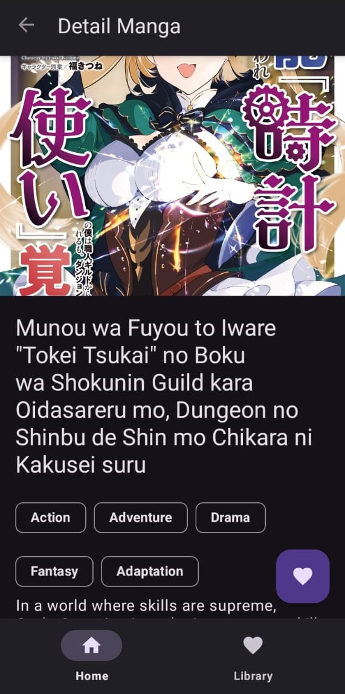

# KomikFinale - Aplikasi Katalog Manga

Aplikasi Android untuk menjelajahi, menyimpan, dan membaca informasi manga, dibuat sebagai Proyek Tugas Akhir Lab Mobile 2025.

**Nama:** Andi Achmad Raihan
**NIM:** H071231077
**Grup Asistensi:** Mobile-10

---

## Deskripsi Aplikasi

KomikFinale adalah aplikasi katalog manga yang memungkinkan pengguna untuk menemukan manga terbaru dan terpopuler dari API publik MangaDex. Pengguna dapat melihat detail informasi dari setiap manga, termasuk deskripsi dan daftar chapter yang tersedia dalam bahasa Inggris.

Proyek ini dibuat untuk memenuhi semua spesifikasi teknis yang diberikan dalam Tugas Final Lab Mobile 2025.

## Screenshot Aplikasi

| Halaman Utama | Halaman Detail | Halaman Favorit (Library) |
| :---: | :---: | :---: |
|  |  |  |

## Fitur Utama

- **Menjelajahi Manga:** Menampilkan daftar 40 manga populer dari API MangaDex.
- **Detail Manga:** Menampilkan halaman detail untuk setiap manga, berisi judul, gambar sampul, dan deskripsi.
- **Daftar Chapter:** Menampilkan daftar chapter yang tersedia dalam bahasa Inggris, terurut dari chapter terlama.
- **Favorit (Database Lokal):** Pengguna dapat menambah dan menghapus manga dari daftar favorit. Daftar ini tersimpan di database lokal (Room/SQLite) dan bisa diakses secara offline.
- **Navigasi:** Menggunakan Navigation Component dengan Bottom Navigation untuk berpindah antara halaman Utama dan Favorit.
- **Mode Terang & Gelap:** Aplikasi mendukung dua mode tema yang bisa diganti untuk kenyamanan pengguna.
- **Penanganan Error:** Menampilkan pesan dan tombol refresh jika gagal mengambil data dari internet.
- **Membuka Chapter:** Menggunakan Intent untuk membuka Activity kedua (`ReaderActivity`) saat sebuah chapter diklik.

## Penjelasan Implementasi Teknis

Aplikasi ini dibangun menggunakan bahasa Java dengan arsitektur MVVM (Model-View-ViewModel). Komponen utama yang digunakan antara lain:

- **Android Jetpack:**
    - **ViewModel:** Untuk mengelola data yang berhubungan dengan UI dan bertahan dari perubahan konfigurasi.
    - **LiveData:** Untuk membuat komponen data yang bisa diobservasi dan bersifat lifecycle-aware.
    - **Room Persistence Library:** Sebagai lapisan abstraksi di atas SQLite untuk membuat database lokal yang robust.
    - **Navigation Component:** Untuk mengelola semua navigasi antar fragment di dalam aplikasi.
- **Networking:**
    - **Retrofit 2:** Sebagai HTTP client untuk berkomunikasi dengan API MangaDex secara deklaratif.
    - **Gson:** Untuk mem-parsing data JSON dari API menjadi objek Java.
- **Asynchronous:**
    - **Executor:** Untuk menjalankan operasi database (insert/delete) di background thread, agar tidak mengganggu UI thread.
- **UI:**
    - **RecyclerView:** Digunakan untuk menampilkan semua daftar data (manga dan chapter) secara efisien.
    - **Material Components:** Untuk komponen UI modern seperti `MaterialCardView`, `BottomNavigationView`, dan `FloatingActionButton`.
    - **Glide:** Untuk memuat dan men-cache gambar dari internet secara efisien.